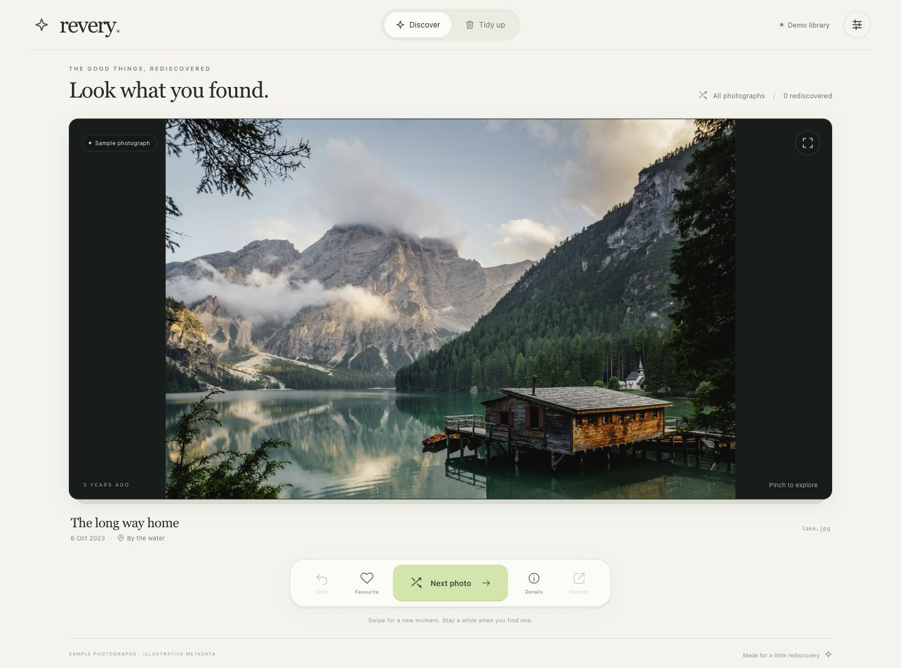
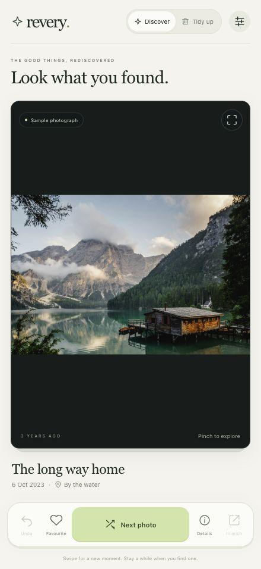
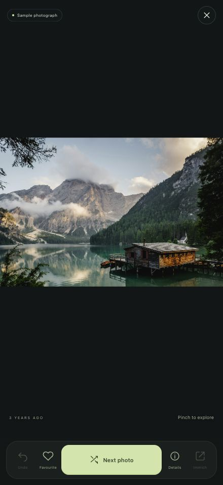

# revery

browse random photographs from your [immich](https://immich.app/) library, with pinch to zoom, metadata and controls within reach on a phone. discovery comes first; an optional tidy-up mode lets you move unwanted photos to immich's recoverable trash.

revery is a small, self-hosted web app. it uses svelte 5, node 24 and sqlite, with no runtime npm dependencies, analytics or external font requests. it connects to immich through the api; it does not need access to your photo folders or immich database.



<p>
  
  
</p>

all screenshots use bundled sample photographs and illustrative metadata. [image credits](docs/credits.md).

## what it does

- shuffles photographs across the library, remembering what you have already seen.
- loads originals where the browser can display them, including heic/heif in compatible browsers.
- supports pinch to zoom, panning and double tap, with uncropped photographs and a fullscreen view.
- shows dates, locations, camera details, dimensions and other available metadata.
- adds or removes immich favourites, and links to the photo in immich's web or mobile app.
- offers a separate tidy-up mode: swipe right to keep, left to trash, then undo if needed.
- works as a responsive website or a home screen app.

this is a personal app for one immich account. anyone with the revery password can see that account's accessible photographs and use the enabled actions. it is not a multi-user immich login service.

## try the demo

you need node 24 or later and pnpm 11.19.0. the version is pinned in `package.json`; [pnpm's installation guide](https://pnpm.io/installation) covers installation.

```sh
git clone https://github.com/Andz200zx/revery.git
cd revery
pnpm install --frozen-lockfile
pnpm dev
```

open [http://127.0.0.1:4310](http://127.0.0.1:4310). without a `.env` file, revery starts in demo mode with three bundled photographs. no immich connection or password is needed. demo actions affect only the sample library. use **settings → start a fresh shuffle** to see previously reviewed samples again.

to run the compiled app instead:

```sh
pnpm build
APP_ORIGIN=http://127.0.0.1:4311 pnpm start
```

the development frontend uses port `4310`; the api and production server use `4311`. both bind to loopback by default.

## connect your immich library

revery has been tested against immich **3.2.4**. other versions may work, but are not currently tested.

### 1. create a dedicated api key

in immich, open your account settings and create a key for revery. enable only the permissions needed for the features you intend to use:

| permission | needed for |
| --- | --- |
| `user.read` | identifying the account and separating its review history |
| `asset.read` | finding photographs and reading metadata |
| `asset.view` | previews and full-size renditions |
| `asset.download` | original files |
| `asset.update` | favourites, if enabled |
| `asset.delete` | trash and restore, if enabled |

the first four are required. if you leave out `asset.update` or `asset.delete`, disable the corresponding feature during setup.

### 2. configure revery

run the setup script in an interactive terminal:

```sh
node scripts/configure.mjs
```

it asks for your revery https address, the immich address reachable from the server, an optional different address for photo links, and which actions to enable. the api key and app password are entered without echo. passwords must contain at least 15 characters.

the script creates `.env`, `secrets/immich_api_key`, `secrets/app_password` and `data/`. it refuses to overwrite an existing `.env`. these paths are excluded from git. keep them private and back them up separately.

if you prefer manual configuration, copy `.env.example` to `.env`, set `APP_MODE=live` and supply the required values. do not put secrets into commands or commit them to git. file-backed secrets are preferable for containers.

### 3. build and serve

for a direct node deployment behind an https proxy:

```sh
pnpm build
pnpm start
```

for docker, follow the container instructions below.

## configuration

| variable | meaning | default |
| --- | --- | --- |
| `APP_MODE` | `demo` or `live` | `demo` |
| `APP_ORIGIN` | the exact address you open in your browser, including any port | `http://127.0.0.1:4310` |
| `EXTRA_ORIGINS` | additional allowed addresses, separated by commas | empty |
| `TRUSTED_PROXIES` | exact IP addresses of reverse proxies whose forwarded client addresses are trusted | empty |
| `IMMICH_URL` | immich's base url, reachable from the revery server | required in live mode |
| `IMMICH_PUBLIC_URL` | base url used by the primary immich photo link | `IMMICH_URL` |
| `IMMICH_ALTERNATE_URL` | optional second immich link, for example a tailnet address | empty |
| `IMMICH_API_KEY_FILE` | path to the api key file | empty |
| `APP_PASSWORD_FILE` | path to the app password file | empty |
| `IMMICH_API_KEY` | api key, when not using a file | empty |
| `APP_PASSWORD` | app password, when not using a file | empty |
| `ENABLE_FAVORITES` | allow changing favourites; requires `asset.update` | `false` in live mode unless set |
| `ENABLE_TRASH` | allow recoverable trash; requires `asset.delete` | `false` |
| `HOST` | address the node server listens on | `127.0.0.1` |
| `PORT` | node server port | `4311` |
| `DATA_DIR` | directory for sqlite state | `./data` |
| `ALLOW_HTTP` | explicit opt-in to unencrypted live access | `false` |

the setup script enables favourites by default unless you choose otherwise. `.env.example` and `compose.yaml` also default favourites to `true`; use `false` when your key lacks that permission.

use immich base urls without `/api`. `APP_ORIGIN` and `EXTRA_ORIGINS` must be explicit origins without paths or credentials. all allowed origins must use the same scheme; wildcards are rejected. if you change the address or port, update these settings and restart revery.

for example, a server might reach immich at `http://immich.lan:2283`, while your browser opens it at `https://immich.example.com`. those belong in `IMMICH_URL` and `IMMICH_PUBLIC_URL` respectively. the addresses above are examples, not a required naming scheme.

## docker

the repository includes a multi-stage dockerfile and compose configuration. there is no published container image; build from source:

```sh
docker compose build
docker compose up -d
docker compose logs --tail=50 revery
```

run setup first so the two secret files exist. on a linux host, the container needs uid/gid `1000:1000` to own the writable data directory and read the secrets. for the dedicated directories created by setup:

```sh
sudo chown -R 1000:1000 data secrets
sudo chmod 700 data secrets
sudo chmod 600 secrets/immich_api_key secrets/app_password
```

compose binds `127.0.0.1:4311`, ready for a proxy on the host. it runs as an unprivileged user with a read-only root filesystem, all capabilities dropped and no new privileges. only the data mount and a small temporary filesystem are writable. the default limits are 256 mib of memory, one cpu and 64 processes.

if your proxy runs in another container, attach both services to a shared network and proxy to `revery:4311`. `127.0.0.1` inside a proxy container refers to that container itself. avoid publishing revery's plain http port more widely just to connect the proxy.

after a validated local frontend build, `Dockerfile.prebuilt` is an alternative:

```sh
docker build -f Dockerfile.prebuilt -t revery:local .
```

### truenas

on truenas 25.10, create dedicated directories or a dataset for revery's source, secrets and state. give the data and secret directories the ownership described above.

build `revery:local` on the nas, then use **apps → discover apps → install via yaml**. adapt `compose.yaml` as follows:

1. remove `build: .` and use the image you built.
2. set `pull_policy: never` when using the local image.
3. replace the relative data and secret paths with your own absolute dataset paths.
4. replace `${...}` configuration placeholders with your own values. keep credentials in file-backed secrets.
5. retain the security settings and configure your proxy to reach the app.

let truenas manage the app lifecycle. do not edit its generated app configuration, or mount immich's library or database into revery.

## https, local access and tailscale

live mode requires an https browser address unless `ALLOW_HTTP=true` is explicitly set. that opt-in sends passwords and photographs without encryption, and some home screen features need a secure context. use trusted https for normal use.

an existing https reverse proxy can forward requests to `http://127.0.0.1:4311`. revery serves both the frontend and api; no special path rewriting is needed. do not cache `/api/` responses. allow enough upstream time for large photographs to stream.

to limit login attempts separately for each client behind a proxy, set `TRUSTED_PROXIES` to the proxy's exact connection IP as seen by revery (for a local host proxy, usually `127.0.0.1`). list every trusted hop if there are multiple proxies. the proxy must append or replace `X-Forwarded-For` with the real client address, and direct client access to revery's port must stay blocked. without this setting, clients sharing a proxy connection also share the login limit. never trust a proxy address that untrusted clients can use directly.

you do not need to expose revery to the internet to use https. for a private network, common options are:

- a domain you own, with certificate validation through dns and name resolution to your local server.
- a local certificate authority trusted by your devices.
- tailscale serve, using its trusted tailnet hostname.

a custom domain is optional. if you make your nas the household's only dns server, name lookup also depends on the nas being available. use independent resolvers or keep that change separate from hosting the app.

with a host-network tailscale installation, you can serve revery on a separate https port:

```sh
tailscale serve --bg --https=8443 http://127.0.0.1:4311
tailscale serve status
```

use the resulting `https://your-server.your-tailnet.ts.net:8443` address as `APP_ORIGIN`, or add it to `EXTRA_ORIGINS` alongside your primary https address. check existing serve routes before changing them. keep serve private; do not enable funnel. if tailscale runs on another network, it needs a reachable revery target instead of loopback.

your phone needs tailscale connected for a tailnet address. ordinary wi-fi access needs its own working local address and certificate. a dns record alone does not provide routing or a certificate for a custom tailnet domain.

## using it

in **discover**, either horizontal swipe moves on. the next-photo button does the same thing. a photograph is marked as seen when you move past it, rather than when it merely loads. **undo** returns to your most recent action.

in **tidy up**, right keeps and left moves the photograph to immich trash. the buttons offer the same actions. undo can restore a trashed photo while it remains in immich trash. immich's retention policy still applies; revery never empties trash or requests permanent deletion.

pinch or double tap to zoom, then drag to pan. a two-finger gesture or a zoomed pan does not trigger a swipe action. reset the zoom before moving on. the fullscreen button hides the surrounding page while keeping the bottom controls available.

on an iphone, open the https address in safari, sign in, then use **share → add to home screen**. revery includes a standalone manifest and safe-area spacing. browser viewport tests cover portrait and landscape layouts; device-specific behaviour should still be checked on your own phone.

| key | action |
| --- | --- |
| right arrow or space | next photo, or keep in tidy-up mode |
| left arrow | trash in tidy-up mode |
| `z` | undo |
| `f` | toggle favourite |
| `i` | details |
| `+` / `-` / `0` | zoom in, out or reset while the viewer has focus |
| escape | leave fullscreen or close a panel |

## image quality and performance

revery requests the original file first. jpeg, png, webp, avif, gif and heic/heif are supported when the browser can decode them. if original decoding fails, it tries immich's browser rendition once. raw and tiff go straight to that fallback after their original response is cancelled.

the quality badge distinguishes an original from a full-size rendition or reduced preview. if immich has no full-size rendition and falls back to a preview, revery shows **preview resolution**. it does not resize or recompress photographs itself. original files are requested with `edited=false`.

the server streams image responses. the browser holds blobs for the current and next full-size image, releasing them when they leave that pair. large images can still use considerable memory while decoded. the service worker caches only the app shell; photographs and api responses are not cached for offline use.

shuffle uses random batches and persisted review history, then a bounded cursor scan when unseen photographs become sparse. it does not download or index the entire library. this is a discovery shuffle, rather than a precomputed, statistically uniform permutation of every asset. searching near the end of a large library can take several requests.

hidden, locked, offline and trashed assets are excluded. accessible stacked images are included. videos are not supported. immich permissions remain the authority for which assets the api key can access.

## privacy and maintenance

the api key stays on the server. private photo routes require a signed-in session and a photograph already issued to the shuffle; image and favourite requests recheck current visibility and availability. state-changing requests require an exact allowed origin and csrf token. sessions use httponly, samesite cookies, with secure cookies on https. failed login attempts are limited per client address when a trusted proxy is configured.

image redirects are accepted only within the configured immich api origin. there is no telemetry, third-party runtime image service or hosted font dependency. keep the app on a private network or tailnet. this is a small personal project and has not had an independent security audit. see [security reporting](SECURITY.md).

sqlite stores review history, undo records, account namespaces, sessions and metadata snapshots, including filenames and locations. treat `data/` as private. favourites and trash state live in immich itself. back up the data directory using a filesystem snapshot or while revery is stopped; a live sqlite database may also have wal files.

to update a container, rebuild and redeploy it while retaining the data and secret mounts. changing the app password revokes sessions on startup. replacing or revoking the immich key also requires a restart. no changes to immich's own database are needed.

## development

```sh
pnpm check
pnpm test
pnpm build
```

the tests use a mock immich server and cover authentication, csrf, review retries, recoverable trash and undo, shuffle fallback, image handling and gesture behaviour. they do not modify a real library. the github workflow runs these checks and builds the container without any private configuration.

the main parts are `src/` for the svelte interface, `server/` for the api and sqlite store, and `test/` for the node test suite. the runtime server uses only node's standard library. production assets are built by vite.

bug reports and small pull requests are welcome. include the browser, immich version and enough detail to reproduce the problem with sample data. keep keys, personal photos, metadata and private network addresses out of issues.

## licence

the code is licensed under [mit](LICENSE). bundled sample photographs have a separate [unsplash licence and credits](docs/credits.md). revery is an independent project and is not affiliated with immich.
